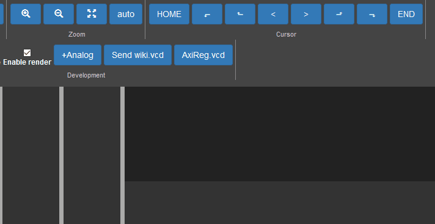

# fliplot
HTML based waveform viewer for HDL simulators.

Fliplot is an alternative to GTKWave, but this is implemented in HTML, Javascript and Python, which
make Fliplot *scriptable*, *pluginable*, *portable*.

See demo at: http://raczben.pythonanywhere.com/

# Contribution

Here are the basic steps to start development.

### Start development server

 0. Clone and enter to this repo.
 1. Install javascript dependencies: `npm i`
 2. start webserver: `npx vite`
